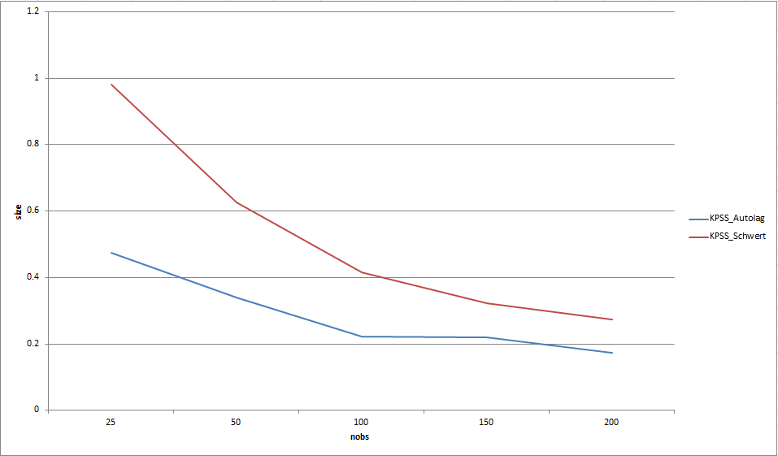

# KPSS autolag
Python implementation of Hobijn et al. (1998) autolag method for KPSS stationarity test. Function has been submitted to statsmodels package.

## Parameters
resids : array_like, 1d \
&nbsp;&nbsp;&nbsp;&nbsp;residual series from KPSS auxiliary regression \
nobs : int \
&nbsp;&nbsp;&nbsp;&nbsp;number of observations

## Returns
lags : int \
&nbsp;&nbsp;&nbsp;&nbsp;number of lags (subdiagonals) to be used in the \
&nbsp;&nbsp;&nbsp;&nbsp;heteroscedsticity- and autocorrelation-consistent \
&nbsp;&nbsp;&nbsp;&nbsp;covariance matrix estimation

## Notes
The KPSS stationarity test has been shown in numerous studies to be extremely sensitive to the number of lags used to estimate the covariance matrix of the auxiliary regression, especially in very small finite-sample cases. The main concern here is that too many lags can lead to potentially severe size distortion in very small finite samples. Kwiatkowski et al. (1992) recommend the rule-of-thumb proposed by Schwert (1989) which is based upon the number of observations. Unfortunately, the Schwert rule-of-thumb is based on asymptotic analysis and suffers from over-lagging in small finite samples leading to over-sized test results. Hobijn et al. (1998) introduce a data-dependent autolag method for the KPSS test, based on previous research from Andrews (1991) and Newey & West (1994). Their results demonstrate a clear reduction in KPSS finite-sample size distortion when using a data-dependent approach to lag selection as opposed to Schwert's asymptotic rule-of-thumb. An example of this reduction is shown in the chart below. The chart was generated with 10,000 Monte Carlo replications at each sample size. As can be seen, the Hobijn data-dependent method reduces the observed size distortion by 50% compared to Schwert.

## References
Andrews, D.W.K. (1991). Heteroskedasticity and autocorrelation consistent covariance matrix estimation. Econometrica, 59: 817-858.

Hobijn, B., Frances, B.H., & Ooms, M. (2004). Generalizations of the KPSS-test for stationarity. Statistica Neerlandica, 52: 483-502.

Kwiatkowski, D., Phillips, P.C.B., Schmidt, P., & Shin, Y. (1992). Testing the Null Hypothesis of Stationarity against the Alternative of a Unit Root. Journal of Econometrics, 54: 159-178.

Newey, W.K., & West, K.D. (1994). Automatic lag selection in covariance matrix estimation. Review of Economic Studies, 61: 631-653.

Schwert, G.W. (1989). Tests for unit roots: A Monte Carlo investigation. Journal of Business & Economic Statistics, 7: 147-159.

## Requirements
Python 3.6 \
Numpy 1.13.1 \
Statsmodels 0.9.0 \
Pandas 0.20.3

## Running
There are no parameters. The program is set up to run five unit tests utilizing various statsmodels data sets. In order to use the autolag function within statsmodels, you will need to modify the KPSS method as follows:

Current: \
&nbsp;&nbsp;&nbsp;&nbsp;if lags is None: \
&nbsp;&nbsp;&nbsp;&nbsp;&nbsp;&nbsp;&nbsp;&nbsp;# from Kwiatkowski et al. referencing Schwert (1989) \
&nbsp;&nbsp;&nbsp;&nbsp;&nbsp;&nbsp;&nbsp;&nbsp;lags = int(np.ceil(12. * np.power(nobs / 100., 1 / 4.)))

New: \
&nbsp;&nbsp;&nbsp;&nbsp;if lags is None: \
&nbsp;&nbsp;&nbsp;&nbsp;&nbsp;&nbsp;&nbsp;&nbsp;# autolag method of Hobijn et al. (1998) \
&nbsp;&nbsp;&nbsp;&nbsp;&nbsp;&nbsp;&nbsp;&nbsp;lags = _kpss_autolag(resids, nobs)

## Additional Info
Please see comments in the source file for additional info including referenced output for the test file.
